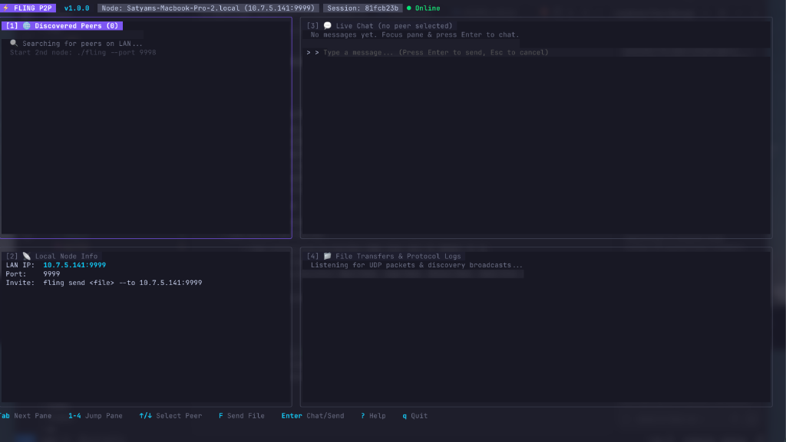

# 🚀 Fling

> **Fast, Zero-Configuration Peer-to-Peer File Transfer & Messaging for your Terminal.**  
> AirDrop-like simplicity, built from scratch on raw UDP with a custom reliable ARQ protocol, automatic LAN peer discovery, and a modern Lazygit-style Terminal UI (TUI).

[](https://golang.org)
[](https://github.com/SatyamKumarCS/Fling-CLI/actions/workflows/ci.yml)
[](https://github.com/SatyamKumarCS/Fling-CLI)
[-50FA7B?style=flat)](https://github.com/SatyamKumarCS/Fling-CLI)
[](https://opensource.org/licenses/MIT)

<br/>

<p align="center">
  
</p>

---

## 📖 Table of Contents

- [What is Fling?](#-what-is-fling)
- [Key Features](#-key-features)
- [How it Works & Architecture](#-how-it-works--architecture)
- [Installation](#-installation)
- [Quick Start & Usage](#-quick-start--usage)
  - [Interactive Mode (TUI)](#1-interactive-mode-tui)
  - [Headless CLI Mode](#2-headless-cli-mode)
- [TUI Keybindings](#-tui-keybindings)
- [Wire Protocol Specification](#-wire-protocol-specification)
- [Testing & Verification](#-testing--verification)
- [License](#-license)

---

## 💡 What is Fling?

Sending files or quick messages between two devices on the same local network shouldn't require third-party cloud services (Slack, Drive, email), manual IP configuration (`scp`, `netcat`), or Apple-only ecosystems (AirDrop).

**Fling** solves this by providing a decentralized, serverless terminal application for macOS, Linux, and Windows. It automatically finds other Fling instances on your LAN, requests recipient consent, transfers files in chunks with end-to-end CRC32 integrity verification, and provides real-time P2P chat—all running over a custom reliable transport layer implemented directly on raw UDP sockets.

---

## ✨ Key Features

- 🔍 **Zero-Config LAN Peer Discovery**: Subnet-directed broadcast automatically finds active peers without entering IP addresses or port numbers. Dead peers are pruned after 10s of inactivity.
- 🛡️ **Custom Reliable UDP Protocol**: Built strictly on Go's standard library (`net.UDPConn`). Implements Stop-and-Wait ARQ, sequence numbers, packet deduplication, out-of-order reassembly, and exponential backoff retries.
- 🤝 **Consent-First Handshake**: Senders transmit a `TRANSFER_REQUEST` containing file metadata (name, size, CRC32 checksum); transfers only proceed when the recipient explicitly accepts.
- 📦 **Chunked & Resilient File Transfer**: Files are streamed in 1024-byte chunks with live progress bars. If packets drop or arrive out of order, Fling reorders and retransmits automatically.
- 🔒 **Zero Silent Corruption**: End-to-end IEEE CRC32 checksum verification ensures received files are byte-identical to originals before saving to disk.
- 📂 **Native File Manager Integration**: Press <kbd>o</kbd> to immediately reveal and highlight received files in **macOS Finder**, Windows Explorer, or Linux File Managers.
- 💬 **Direct Instant Messaging**: Chat directly with any online peer without initiating file transfers.
- 🎨 **Modern Terminal Dashboard**: Full-screen, high-contrast multi-pane interface (Lazygit-style) built with Charm's [Bubbletea](https://github.com/charmbracelet/bubbletea) and [Lipgloss](https://github.com/charmbracelet/lipgloss).

---

## 🏗️ How it Works & Architecture

Fling operates entirely peer-to-peer with no centralized server or coordinator.

```
┌─────────────────────────────────────────────────────────────────────────┐
│                           FLING ARCHITECTURE                            │
├─────────────────────────────────────────────────────────────────────────┤
│  [1] TUI / CLI Layer      │ Bubbletea TUI, Lipgloss styles, CLI parser  │
│  [2] Discovery Service    │ UDP Subnet Broadcasts (Port 9999 / 9998)    │
│  [3] Handshake Manager    │ TRANSFER_REQUEST / ACCEPT / REJECT flow     │
│  [4] Reliable Transport   │ Stop-and-Wait ARQ, Sequence IDs, Retries    │
│  [5] Chunking & Assembly  │ 1024B Chunker, Out-of-Order Buffer, CRC32   │
│  [6] Wire Protocol Codec  │ 11-Byte Binary Header + Payload Serialization│
└─────────────────────────────────────────────────────────────────────────┘
```

### 11-Byte Wire Packet Format

Every datagram transmitted by Fling conforms to a deterministic 11-byte binary header followed by the payload:

```text
 0                   1                   2                   3
 0 1 2 3 4 5 6 7 8 9 0 1 2 3 4 5 6 7 8 9 0 1 2 3 4 5 6 7 8 9 0 1
+-+-+-+-+-+-+-+-+-+-+-+-+-+-+-+-+-+-+-+-+-+-+-+-+-+-+-+-+-+-+-+-+
|                       Sequence Number                         |
+-+-+-+-+-+-+-+-+-+-+-+-+-+-+-+-+-+-+-+-+-+-+-+-+-+-+-+-+-+-+-+-+
|     Type      |        Payload Length         |    CRC32 ...  |
+-+-+-+-+-+-+-+-+-+-+-+-+-+-+-+-+-+-+-+-+-+-+-+-+-+-+-+-+-+-+-+-+
|      ... Checksum             |            Payload ...        |
+-+-+-+-+-+-+-+-+-+-+-+-+-+-+-+-+-+-+-+-+-+-+-+-+-+-+-+-+-+-+-+-+
|                          ... Payload                          |
+-+-+-+-+-+-+-+-+-+-+-+-+-+-+-+-+-+-+-+-+-+-+-+-+-+-+-+-+-+-+-+-+
```

| Field | Size | Description |
|---|---|---|
| **Sequence Number** | 4 Bytes (`uint32`) | Monotonically increasing packet sequence number |
| **Packet Type** | 1 Byte (`uint8`) | `PRESENCE` (1), `TRANSFER_REQ` (2), `ACCEPT` (3), `REJECT` (4), `MSG` (5), `FILE_CHUNK` (6), `FILE_END` (7), `ACK` (8) |
| **Payload Length** | 2 Bytes (`uint16`) | Length of trailing payload buffer (0 to 65,535 bytes) |
| **CRC32 Checksum** | 4 Bytes (`uint32`) | IEEE 802.3 CRC32 computed over header + payload |

---

## 📦 Installation

### Option 1: One-Line Auto Installer (macOS & Linux)

```bash
curl -fsSL https://raw.githubusercontent.com/SatyamKumarCS/Fling-CLI/main/install.sh | bash
```

*Or if you cloned the repository locally:*
```bash
./install.sh
```

### Option 2: Go Install

```bash
go install github.com/SatyamKumarCS/Fling-CLI/cmd/fling@latest
```

### Option 3: Build from Source (Make)

```bash
git clone https://github.com/SatyamKumarCS/Fling-CLI.git
cd Fling-CLI
make install
```

---

## 🚀 Quick Start & Usage

### 1. Interactive Mode (TUI)

Simply run `fling` to launch the multi-pane interactive dashboard:

```bash
fling
```

To run multiple instances on the same machine for testing, specify custom ports:
```bash
# Terminal 1
fling --port 9999

# Terminal 2
fling --port 9998
```

#### Dashboard Panes:
- **`[1] DISCOVERED PEERS`**: Live table of all active nodes on your LAN with IP, hostname, and status.
- **`[2] LOCAL NODE INFO`**: Your node's local IP, active UDP listening port, session ID, and quick invite command.
- **`[3] LIVE CHAT`**: Real-time peer-to-peer messaging stream.
- **`[4] TRANSFERS & PROTOCOL ACTIVITY`**: Real-time protocol log showing packet transmissions, ACKs, handshakes, and file download progress.

#### 🎯 Step-by-Step Interactive Workflow:

1. **Automatic Discovery**:
   - Start `fling` on both computers. Within seconds, both nodes discover each other and appear in **`[1] DISCOVERED PEERS`**.
2. **Sending a File**:
   - Use <kbd>↑</kbd> / <kbd>↓</kbd> to highlight the target peer.
   - Press <kbd>F</kbd> (or <kbd>s</kbd>) to open the centered file prompt dialog.
   - Type a file path (e.g., `document.pdf`, `~/Desktop/report.zip`, or drag-and-drop from Finder) and press <kbd>Enter</kbd>.
3. **Receiving Consent**:
   - The receiving device displays a centered dialog: `Incoming file request: filename (size) — Accept [y/n]?`.
   - Press <kbd>y</kbd> to accept or <kbd>n</kbd> to decline.
4. **Live Transfer & Checksum Verification**:
   - File streams reliably over UDP chunks with live progress tracking in **`[4] TRANSFERS & PROTOCOL ACTIVITY`**.
   - CRC32 checksum is verified upon completion before committing the file to disk.
5. **Reveal in Finder**:
   - Press <kbd>o</kbd> (or <kbd>O</kbd>) to instantly highlight the downloaded file in **Finder** / File Manager.
6. **Live Instant Messaging**:
   - Press <kbd>Enter</kbd> or <kbd>c</kbd>, type your message in the chat prompt, and press <kbd>Enter</kbd> to send direct datagram messages.

---

### 2. Headless CLI Mode

Fling can also be used non-interactively in shell scripts or terminal workflows:

#### 📡 Discover Active LAN Peers:
```bash
fling peers
```

#### 📁 Send a File:
```bash
# Send by Peer Index (from 'fling peers')
fling send report.pdf --to 1

# Send by Hostname
fling send archive.tar.gz --to Satyam-MacBook.local

# Send by IP and Port
fling send photo.png --to 192.168.1.50:9999
```

#### 💬 Send an Instant Message:
```bash
fling msg "Deployment complete on staging server." --to 1
fling msg "Hello from terminal!" --to 192.168.1.50:9999
```

---

## ⌨️ TUI Keybindings

| Key | Action | Description |
|---|---|---|
| <kbd>Tab</kbd> / <kbd>Shift+Tab</kbd> | **Next / Prev Pane** | Cycle active focus between the 4 panes |
| <kbd>1</kbd>, <kbd>2</kbd>, <kbd>3</kbd>, <kbd>4</kbd> | **Jump to Pane** | Directly activate Peers (1), Info (2), Chat (3), or Transfers (4) |
| <kbd>↑</kbd> / <kbd>↓</kbd> or <kbd>k</kbd> / <kbd>j</kbd> | **Select Peer** | Highlight a peer in the Discovered Peers list |
| <kbd>F</kbd> / <kbd>s</kbd> | **Send File** | Open file selector dialog to transmit to selected peer |
| <kbd>Enter</kbd> / <kbd>c</kbd> / <kbd>m</kbd> | **Chat** | Focus chat input to send an instant message |
| <kbd>o</kbd> / <kbd>O</kbd> | **Reveal in Finder** | Reveal the received file highlighted in macOS Finder / Explorer |
| <kbd>y</kbd> / <kbd>n</kbd> | **Accept / Decline** | Accept or reject an incoming file transfer request modal |
| <kbd>r</kbd> | **Scan** | Send immediate UDP presence beacon to refresh peer discovery |
| <kbd>?</kbd> | **Help** | Toggle centered keybindings cheat sheet modal |
| <kbd>Esc</kbd> | **Cancel / Back** | Close dialogs, unfocus chat, or cancel active prompts |
| <kbd>q</kbd> / <kbd>Ctrl+C</kbd> | **Quit** | Exit Fling |

---

## 📑 Wire Protocol Specification

For the complete RFC-style technical specification of packet framing, Stop-and-Wait ARQ state machines, handshake negotiation, and retransmission timing, see [docs/protocol.md](docs/protocol.md).

---

## 🧪 Testing & Verification

Fling includes comprehensive automated unit, stress, and integration test suites covering:
- Packet encoding/decoding and CRC32 corruption detection.
- Subnet broadcast discovery and peer timeout pruning.
- Stop-and-Wait ARQ reliable delivery under **30% simulated packet loss**.
- Out-of-order chunk arrival, reassembly, and deduplication.
- End-to-end handshake consent flow and file integrity verification.

Run the test suite with the Go race detector enabled:

```bash
make test-race
# or
go test -v -race ./...
```

---

## 🤝 Contributing

Contributions, issues, and feature requests are welcome! Feel free to check the [issues page](https://github.com/SatyamKumarCS/Fling-CLI/issues).

---

## 📄 License

This project is licensed under the MIT License - see the [LICENSE](LICENSE) file for details.
